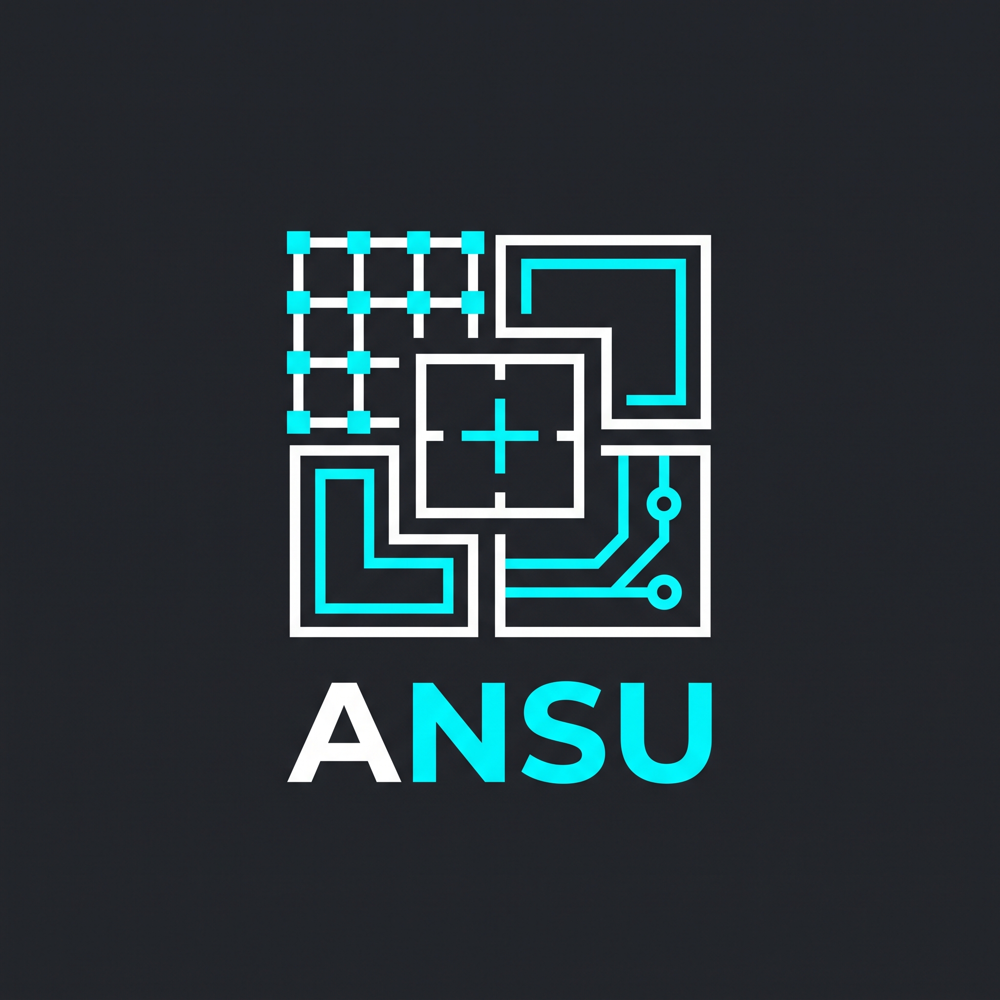

# ANSU

  

Кастомный 2D-движок на **C#** и **MonoGame** с упором на чистую **ECS**-архитектуру и интеграцию с тайловыми картами **Tiled**.

---

### Архитектура

* **Core ECS:** Data-oriented подход, компоненты на `struct`, быстрый доступ через `CollectionsMarshal`.
* **Systems:** Разделение логики по системам (`Movement`, `Input`, `Physics`).
* **Scenes & Maps:** Менеджер сцен и парсинг уровней из Tiled (`.tmj` / JSON).

---

### Стек

* .NET 8 / C#
* MonoGame
* System.Text.Json

